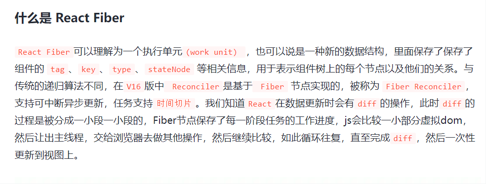

fiber 是 react 16 以上的版本引入的非常重要的概念。
什么是 fiber?
fiber 是 v16 之后的虚拟 dom diff 算法，stack 是 v16 前的虚拟 dom diff 算法，使用的是深度优先遍历去遍历节点，会将下面这张图转变为


```json
const root={
	key:'A',
	children:[
		{
            key:'B',
            children:[
                {
                    key:'D',
                },
                {
                    key:'E',
                }

            ]
		},
        {
            key:'C',
            children:[
                {
                    key:'F',
                },
                {
                    key:'G'
                }
            ]
        }
	]
}
const walk=(root)=>{
    root.children.forEach((child)=>{
        walk(child)
    })
}
walk(root);

```

这棵树使用的是递归遍历，树越大栈越深，如果发生中断，那么整棵树都不能恢复。并且寻找节点期间浏览器无法响应，树越大越卡顿。




https://juejin.cn/post/7225957841319379005#heading-3

什么是 fiber
fiber 是 react16 提出的一种新的架构，支持中断异步。Fiber 对象是一个用于保存「组件状态」、「组件对应的 DOM 的信息」、以及「工作任务 (work)」的数据结构，负责管理组件实例的更新、渲染任务、以及与其他 fiber node 的关系。每个组件（react element）都有一个与之对应关联的 Fiber 对象实例（fiber node），和 react element 不一样的是，fiber node 不需要再每一次界面更新的时候都重新创建一遍。
在执行 Reconciliation 这个算法的期间，组件 render 方法所返回的 react element 的信息（属性）都会被合并到对应的 fiber node 中。这些 fiber node 因此也组成了一棵与 react element tree 相对应的 fiber node tree。（我们要牢牢记住的是：每个 react element 都会有一个与之对应的 fiber node）。
