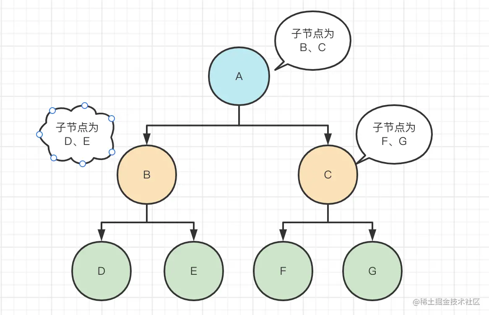

fiber 是 react 16 以上的版本引入的非常重要的概念。
什么是 fiber?
fiber 是 v16 之后的虚拟 dom diff 算法，stack是v16 前的虚拟dom diff算法，使用的是深度优先遍历去遍历节点，会将下面这张图转变为


```json
const root={
	key:'A',
	children:[
		{
            key:'B',
            children:[
                {
                    key:'D',
                },
                {
                    key:'E',
                }
                
            ]
		},
        {
            key:'C',
            children:[
                {
                    key:'F',
                },
                {
                    key:'G'
                }
            ]
        }
	]
}
const walk=(root)=>{
    root.children.forEach((child)=>{
        walk(child)
    })
}
walk(root);

```

这棵树使用的是递归遍历，树越大栈越深，如果发生中断，那么整棵树都不能恢复。并且寻找节点期间浏览器无法响应，树越大越卡顿。


