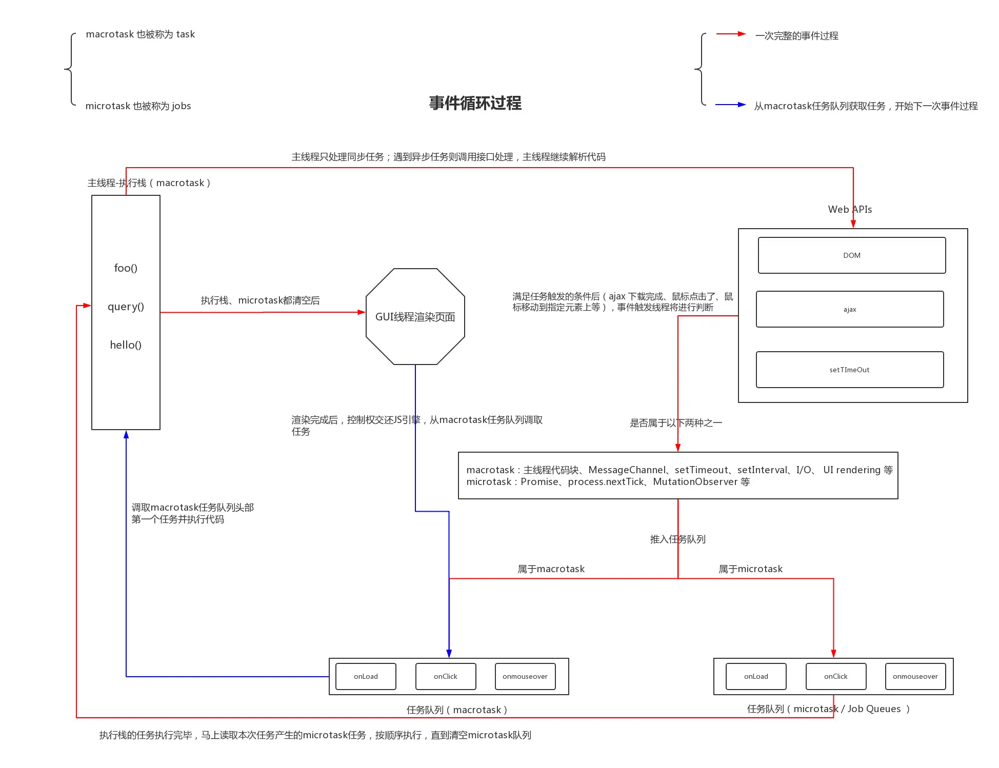

众所周知，JS是单线程执行的，指的是一个进程里只有一个主线程。

##### 浏览器事件循环

- 宏任务：`setTimeout`、`setInterval`、`网络请求`
- 微任务：`promise`、 `async/await`、`MutationObserve 监听dom变化`



在浏览器的Event Loop中是有多个任务队列的，每个任务队列的执行时机是不一样的，下面直接上干货，说说浏览器执行任务的顺序

1. 从task任务队列中取第一个task（比如setTimeout、setIntervel的回调，也可以将同一轮循环中的所有同步代码看作是一个宏任务），执行它。

2. 执行微任务队列里的所有微任务。

3. 浏览器判断是否更新渲染屏幕，如果需要重新绘制，则执行步骤4-13，如果不需要重新绘制，则流程回到步骤1，这样不断循环。

4. 触发resize、scroll事件，建立媒体查询（执行一个任务中如果生成了微任务，则执行完任务该后就会执行所有的微任务，然后再执行下一个任务）。

5. 建立css动画（执行一个任务中如果生成了微任务，则执行完该任务后就会执行所有的微任务，然后再执行下一个任务）。

6. 执行requestAnimationFrame回调（执行一个任务中如果生成了微任务，则执行完该任务后就会执行所有的微任务，然后再执行下一个任务）。

7. 执行 IntersectionObserver 回调（执行一个任务中如果生成了微任务，则执行完该任务后就会执行所有的微任务，然后再执行下一个任务）。

8. 更新渲染屏幕。

9. 浏览器判断当前帧是否还有空闲时间，如果有空闲时间，则执行步骤10-12。

10. 从 requestIdleCallback回调函数队列中取第一个，执行它。

11. 执行微任务队列里的所有微任务。

12. 流程回到步骤9，直到requestIdleCallback回调函数队列清空或当前帧没有空闲时间。

13. 流程回到步骤1，这样不断循环。

    ```
    requestAnimationFrame(()=>{
    	//请求浏览器在下次重绘之前调用用户提供的回调函数
        console.log(111);
        setTimeout(() => {
            console.log(222);
        });
        Promise.resolve().then(() => {
            console.log(333);
        });
    })
    
    requestAnimationFrame(() => {
        console.log(444);
        Promise.resolve().then(() => {
            console.log(555);
        });
    })
    ```

    ##### nodejs的事件循环

    nodejs 也是用了 V8 引擎和 ES 语法，所以也有同步、异步，异步也分宏任务、微任务。

    - setTimeout setInterval —— 宏任务
    - promise 和 async/await  —— 微任务
    - process.nextTick —— 微任务，**但优先级最高**
    - setImmediate —— 宏任务
    - I/O 文件、网络 —— 宏任务
    - Socket 连接：连接 mysql —— 宏任务

    

    

## 答案


- 事件循环的大概模式相同
- nodejs的事件循环 宏任务有优先级区分
- nodejs的事件循环 `process.nextTick` 在微任务的优先级更高

但是，`process.nextTick` 在最新版 nodejs 中不被推荐使用，推荐使用 `setImmediate` 原因在于 `process.nextTick` 是在当前帧介绍后立即执行，会阻断IO并且有最大数量限制（递归时会有问题） 而 `setImmediate` 不会阻断 IO ，更像是 `setTimeout(fun, 0)`

https://juejin.cn/post/7087498475599822856

https://www.jianshu.com/p/ba5828330aec

https://vue3js.cn/interview/NodeJS/event_loop.html#%E4%B8%80%E3%80%81%E6%98%AF%E4%BB%80%E4%B9%88
